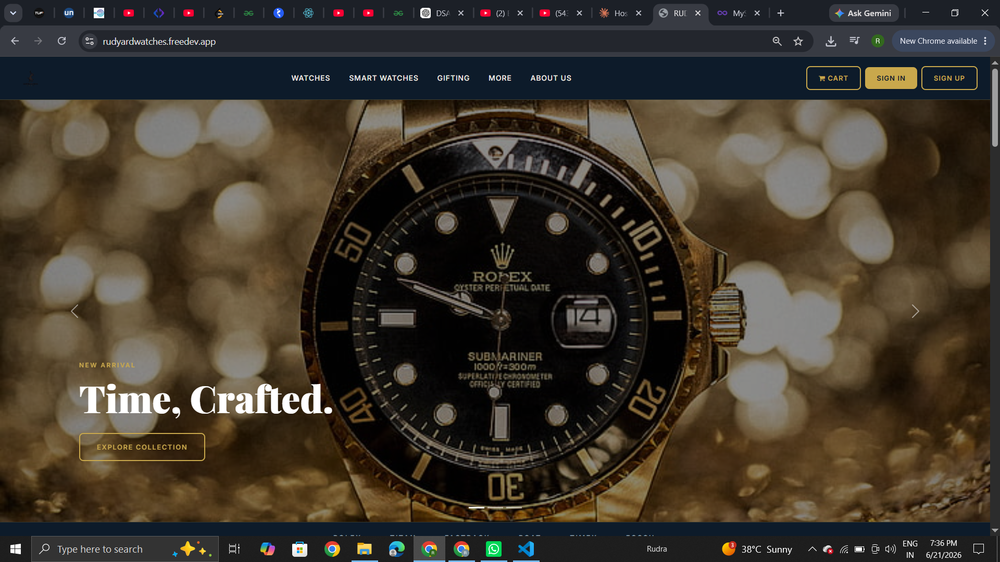

# ⌚ Rudyard Watches — Men's Watch E-Commerce Website


## 🌐 Live Demo
**[👉 View Live Site](http://rudyardwatches.freedev.app)**

---

## 📌 About the Project

A fully responsive men's watch e-commerce website built as a 1st year internship project. Started as a static showcase site and has since grown into a complete full-stack application — featuring a premium dark UI with gold accents, real user authentication, a database-driven product catalog, a working shopping cart, and a live Razorpay test-mode payment integration with server-side signature verification.

---

## ✨ Features

- 🎨 Premium dark navy + gold UI design
- 📱 Fully responsive (mobile, tablet, desktop)
- 🎴 Interactive flip cards for collection showcase
- 🔍 Live search/filter on price table
- 🔐 **User authentication** — signup & login with bcrypt password hashing (`password_hash` / `password_verify`) and PHP sessions
- 🛒 **Shopping cart** — session-based, login-gated, add/update/remove items
- 💳 **Real payment integration** — Razorpay test-mode checkout:
  - Backend creates a Razorpay order via their REST API
  - Razorpay's official checkout widget handles card entry
  - Payments are verified server-side with **HMAC-SHA256 signature verification** before any order is marked paid
- 📦 **Dynamic product catalog** — watches stored in and rendered from a MySQL `products` table, not hardcoded HTML
- 🧾 **Order history** — completed orders and line items saved to the database
- 🛡️ SQL injection prevention (prepared statements everywhere)
- 💾 MySQL database integration (4 linked tables: `users`, `products`, `orders`, `order_items`)
- 🌐 Deployed live on InfinityFree hosting

---

## 🛠️ Tech Stack

| Frontend | Backend | Database | Payments | Hosting |
|---|---|---|---|---|
| HTML5, CSS3 | PHP 8.x | MySQL | Razorpay REST API (test mode) | InfinityFree |
| Bootstrap 5.3 | mysqli (prepared statements) | | | |git add -A
| JavaScript (jQuery) | | | | |

---

## 📂 Project Structure

```
RUDYARD_WATCHES_WEBSITE/
│
├── index.php                  # Homepage — products loaded dynamically from DB
├── form.html                  # Signup page
├── submit.php                 # Signup handler (validation + password hashing)
├── login.html                 # Login page
├── login.php                  # Login handler (password verification + sessions)
├── logout.php                 # Session destruction
├── cart.php                   # View / update / remove cart items
├── cart_actions.php           # Add / remove / update cart (session-based)
├── checkout.php                # Order summary + Razorpay order creation
├── payment_success.php          # Signature verification + order finalization
│
├── config/
│   ├── db.php                  # DB credentials (gitignored)
│   └── razorpay.php              # Razorpay API keys (gitignored)
│
└── assest/
    ├── css/style.css            # Custom styles
    ├── js/style.js               # Form validation + UI interactions
    └── images/                   # Watch product images
```

---

## 🗄️ Database Schema

```
users           products          orders                  order_items
├ id            ├ id              ├ id                     ├ id
├ fname         ├ name            ├ user_id      (FK)       ├ order_id    (FK)
├ lname         ├ brand           ├ razorpay_order_id        ├ product_id  (FK)
├ contact       ├ price           ├ razorpay_payment_id       ├ product_name
├ email         └ image_path      ├ total_amount              ├ price
├ password                        ├ status                    └ quantity
├ address                         ├ shipping_address
└ pin_code                        └ created_at
```

---

## 💳 How the Payment Flow Works

1. User clicks **Pay** on the checkout page
2. Backend calls Razorpay's `/v1/orders` API to create an order, using a total calculated **server-side** from the database — never trusting a client-submitted amount
3. Razorpay's checkout widget opens for the user to enter test card details
4. On success, Razorpay returns a `payment_id`, `order_id`, and `signature`
5. Backend recomputes the signature with `hash_hmac('sha256', order_id . '|' . payment_id, secret_key)` and compares it using `hash_equals()`
6. Only a matching signature gets the order marked `paid` — otherwise it's marked `failed` and nothing is fulfilled

This stops anyone from faking a "successful payment" by intercepting or replaying the client-side callback.

---

## 🚀 Run Locally

1. Clone the repo:
```bash
git clone https://github.com/Rudra9461/RUDYARD_WATCHES_WEBSITE.git
```

2. Set up XAMPP (Apache + MySQL running), or use a host with outbound cURL enabled (required for the Razorpay API calls)

3. Copy project to `htdocs`:
```bash
C:\xampp\htdocs\RUDYARD_WATCHES\
```

4. Create the database and tables in phpMyAdmin:
```sql
CREATE DATABASE rudyard_watches;
USE rudyard_watches;

CREATE TABLE users (
  id INT AUTO_INCREMENT PRIMARY KEY,
  fname VARCHAR(50) NOT NULL,
  lname VARCHAR(50) NOT NULL,
  contact VARCHAR(15) NOT NULL,
  email VARCHAR(100) NOT NULL UNIQUE,
  password VARCHAR(255) NOT NULL,
  address TEXT NOT NULL,
  pin_code VARCHAR(10) NOT NULL,
  created_at TIMESTAMP DEFAULT CURRENT_TIMESTAMP
);

CREATE TABLE products (
  id INT AUTO_INCREMENT PRIMARY KEY,
  name VARCHAR(150) NOT NULL,
  brand VARCHAR(60) NOT NULL,
  price DECIMAL(10,2) NOT NULL,
  image_path VARCHAR(255) NOT NULL,
  created_at TIMESTAMP DEFAULT CURRENT_TIMESTAMP
);

CREATE TABLE orders (
  id INT AUTO_INCREMENT PRIMARY KEY,
  user_id INT NOT NULL,
  razorpay_order_id VARCHAR(100) NOT NULL,
  razorpay_payment_id VARCHAR(100) DEFAULT NULL,
  total_amount DECIMAL(10,2) NOT NULL,
  status VARCHAR(20) NOT NULL DEFAULT 'created',
  shipping_address TEXT NOT NULL,
  created_at TIMESTAMP DEFAULT CURRENT_TIMESTAMP,
  FOREIGN KEY (user_id) REFERENCES users(id)
);

CREATE TABLE order_items (
  id INT AUTO_INCREMENT PRIMARY KEY,
  order_id INT NOT NULL,
  product_id INT NOT NULL,
  product_name VARCHAR(150) NOT NULL,
  price DECIMAL(10,2) NOT NULL,
  quantity INT NOT NULL,
  FOREIGN KEY (order_id) REFERENCES orders(id),
  FOREIGN KEY (product_id) REFERENCES products(id)
);
```

5. Copy `config/db.example.php` → `config/db.php` and add your MySQL credentials

6. Get free test API keys from [Razorpay](https://dashboard.razorpay.com) (Test Mode → Generate Key), then copy `config/razorpay.example.php` → `config/razorpay.php` and add them

7. Visit: `http://localhost/RUDYARD_WATCHES/`

---

## 🔭 Known Limitations / Next Steps

- Cart is session-based, not persisted to the database — doesn't survive across devices
- No admin panel yet for managing products or viewing orders
- No automated test suite (manual testing only so far)
- No email notifications on order confirmation
- Currently Razorpay **test mode only** — going live needs KYC verification + live API keys

---

## 👨‍💻 Developer

**Rudra Pratap Singh**
- GitHub: [@Rudra9461](https://github.com/Rudra9461)
- Email: pratapsinghr782@gmail.com

---

## 📸 Screenshots
